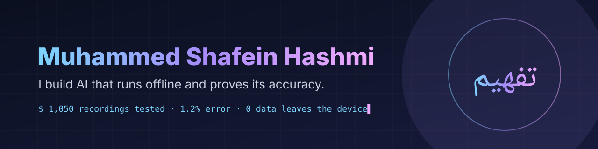

Speech AI that works with no internet, AI tutors that grade you, and tools that turn a photo into a priced delivery route. Built, measured, shipped.

### Start here

| Project | What it does |
|---|---|
| **[Tafheem](https://github.com/shaf-aston/tafheem)** · [live](https://tafheem-app.vercel.app) | Quranic and classical Arabic, word by word: grammar trees, i'raab, morphology, recitation checking by voice, 4 classical dictionaries.  |
| **[Dictation for Radiology](https://github.com/shaf-aston/Dictation-radio-medical)** | Offline speech-to-text for radiologists. No patient audio leaves the machine.  |
| **[FYP Sales Trainer](https://github.com/shaf-aston/FYP-sales-training-tool)** | Practise a sales call against an AI buyer, then get a turn-by-turn review of where the deal was won or lost.  |
| **[Acquire Logistics](https://github.com/shaf-aston/acquire-logi-sequence)** | Photo of a cargo list in, priced delivery route out, packed in 3D.  |
| **[One Way Out](https://github.com/shaf-aston/One-Way-Out)** | Live map and control panel for AI coding agents. Zero dependencies.  |

More

- [Team-21](https://github.com/shaf-aston/Team-21): electronics e-commerce platform (team project, Laravel)
- [GRWTH Discord Bot](https://github.com/shaf-aston/GRWTH-Discord-Bot): community bot
- [KhurramConsulting](https://github.com/shaf-aston/KhurramConsulting): client website

### How I build

- **Layers.** Thin interface, services that orchestrate, a pure core with no I/O. Logic flows one way.
- **Swappable parts.** Every model or outside service sits behind one interface; changing engine is a config line.
- **Proven.** Each design choice is benchmarked: Tafheem's recitation checker, 1,050 recordings, 1.2% error.
